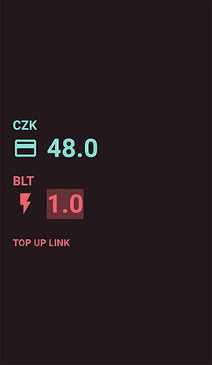

#  Bolt
⚡️ Bolt is an Android app that lets you convert between Bolts (official Let it Roll 2017 festival currency) and Czech Crowns.
I don't have a Google Play dev account, therefore it's not available on the store.
Feel free to clone and build, or just [Download an APK here](apk/bolt.apk?raw=true)

Written in Kotlin 💚

